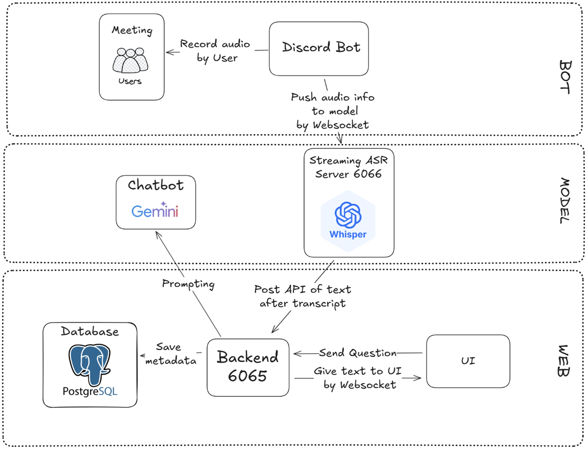
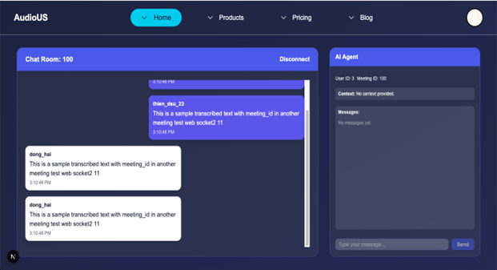

# 🎙️ Intelligent Meeting Assistant on Discord 

---

## 🚀 Giới thiệu  

**Intelligent Meeting Assistant on Discord** là một hệ thống hỗ trợ họp thông minh trên nền tảng **Discord**, tích hợp công nghệ **AI** để:  

- 🎧 Chuyển giọng nói thành văn bản theo **thời gian thực** với độ trễ thấp.  
- 📝 **Tự động tóm tắt** nội dung cuộc họp.  
- 🤖 Hỗ trợ **hỏi – đáp thông minh** trong quá trình họp, không gián đoạn người nói.  

👉 Giúp người dùng dễ dàng theo dõi – ghi nhớ – tra cứu nội dung trong các cuộc họp trực tuyến.  

---

## 🏗️ Kiến trúc hệ thống  

Hệ thống gồm 4 thành phần chính:  

### 1. Discord Bot  
- Ghi âm giọng nói từ voice channel.  
- Phát hiện khoảng lặng.
- Tiền xử lý âm thanh.
- Tích lũy & chuẩn hóa dữ liệu âm thanh (float32)
- Đóng gói thành payload, gửi qua WebSocket đến Whisper Streaming Service.  

### 2. Whisper Streaming Service 
- Xử lý audio bằng **Whisper Streaming**.  
- Trả về transcript (văn bản).  

### 3. Backend Service  
- Quản lý transcript với **PostgreSQL**.  
- Tích hợp **Gemini API** để sinh tóm tắt & hỏi – đáp.  
- Xác thực người dùng qua **Discord OAuth2**.  
- Quản lý thanh toán qua **Stripe**.  

### 4. Frontend (UI)  
- Xây dựng bằng **Next.js 15**.  
- Hiển thị transcript theo thời gian thực.  
- Xuất bản tóm tắt PDF.  
- Tích hợp chatbot hỏi – đáp và quản lý thanh toán.  

### 🔎 Sơ đồ kiến trúc  

---

## 🛠️ Công nghệ sử dụng

* **Speech Recognition**: Whisper Streaming (Faster-Whisper)
* **Ngôn ngữ lập trình**: Python, Golang, JavaScript/TypeScript
* **Frontend**: Next.js 15 (App Router, SSR, WebSocket)
* **Backend**: Golang + FastAPI (Model Service)
* **Database**: PostgreSQL
* **AI Services**: Gemini API
* **Thanh toán**: Stripe API
* **Triển khai**: Docker, GitHub Actions, Vercel

---
## Giao diện người dùng 

## Sử Dụng

1. Mời bot vào server Discord, dùng lệnh /record để bắt đầu ghi âm.
2. Theo dõi transcript realtime trên UI.
3. Đánh dấu text & hỏi chatbot (Command + I).
4. Kết thúc họp bằng /stop_recording, tải summary PDF.

## 📊 Demo & Đánh giá

* **Demo**: [Xem video demo](https://drive.google.com/file/d/1PXt-HKPJw_cvLbczHjey7T_uHZrv824p/view?usp=sharing)
* **Độ trễ trung bình**: 3.7 – 6.0 giây.
* **Tính năng chính**:
  - ✅ Transcript thời gian thực
  - ✅ Tóm tắt thông minh
  - ✅ Hỏi – đáp AI
  - ✅ Xuất file PDF
  - ✅ Tích hợp thanh toán

